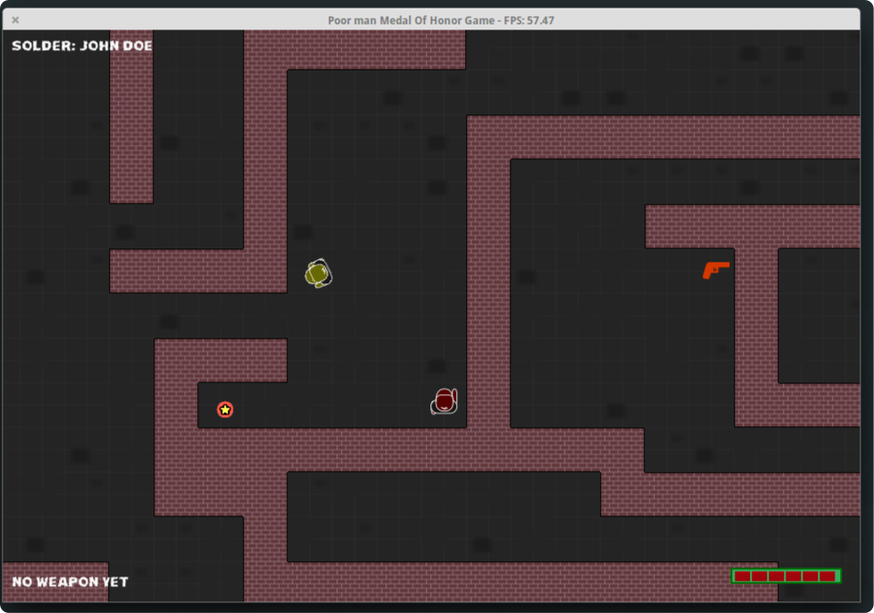

Poor man Game: Medal of Honor
=============================

Entry in PyWeek #21  <http://www.pyweek.org/21/>
Author: Remigijus Jarmalavičius (aka ReekenX)

Dependencies
============

You might need to install some of these before running the game:

  Python:     http://www.python.org/
  PyGame:     http://www.pygame.org/

Running the game
================

On Windows or Mac OS X, locate the "run_game.pyw" file and double-click it.

Othewise open a terminal / console and "cd" to the game directory and run:

  python run_game.py

How to play the game
====================

Kill enemies until they noticed you.

Press the left mouse button to fire.

Screenshots
===========

License
=======

GPL.
